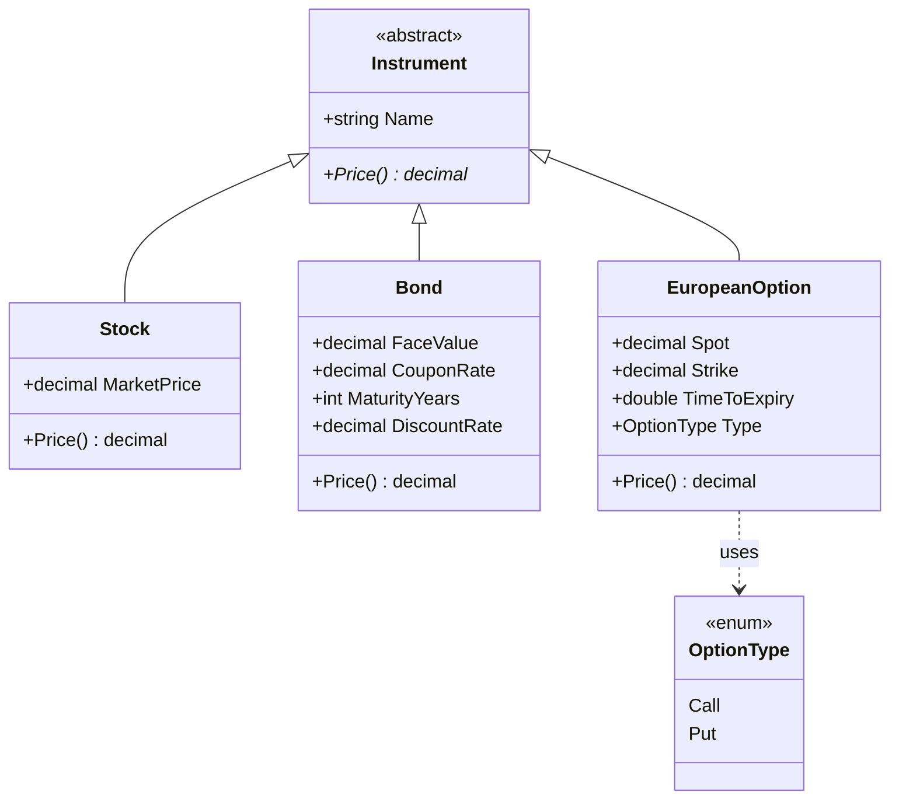

# Design A — Pricing Inside Instrument

Class diagram for the inheritance-based design where every `Instrument`
subclass owns its `Price()` implementation.

### Notes

* `Price()` is declared `abstract` on `Instrument` so every subclass must
  supply its own implementation.
* `Stock.Price()` returns its market quote.
* `Bond.Price()` sums discounted coupons plus discounted face value
  using continuous compounding on a flat yield curve.
* `EuropeanOption.Price()` returns the undiscounted intrinsic value
  `max(Spot - Strike, 0)` for a call.
* Adding a *new way* to price an option (e.g. Monte Carlo) would require
  either modifying `EuropeanOption.Price()` itself, adding a parallel
  method, or sub-subclassing `EuropeanOption` — all of which entangle
  pricing strategy with the instrument hierarchy.
