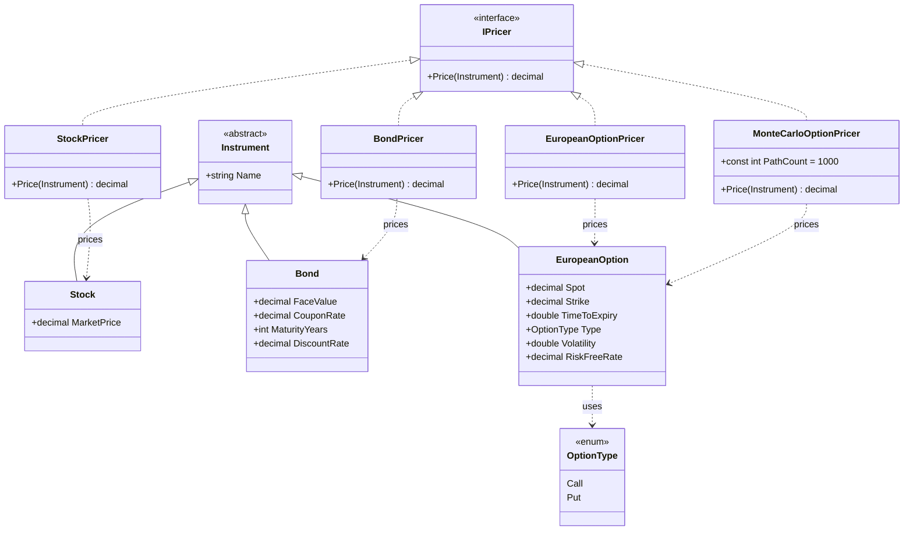

# Design B — Pricing via Strategy

Class diagram for the strategy-based design where instruments hold only
data and pricing logic lives in `IPricer` implementations.

### Notes

* `Instrument` and its subclasses are pure data — no behaviour.
* Each pricer accepts the abstract `Instrument` and type-checks the
  concrete type it expects.
* `EuropeanOption` is priced by **two** different `IPricer`s
  (`EuropeanOptionPricer` and `MonteCarloOptionPricer`) without any
  change to the instrument class. Adding a third pricer (e.g. binomial
  tree, Heston model, …) is the same one-class change.
* Tests can mock `IPricer` directly to exercise portfolio code in
  isolation from any specific pricing model.
